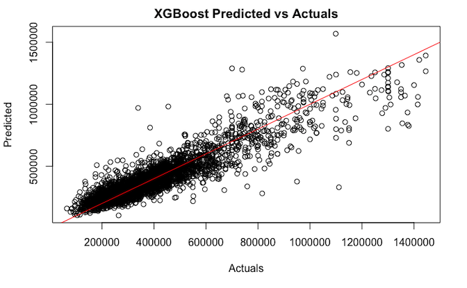

# Nashville Real Estate

House prices are a common project topic for data science learners. I've attempted to make this more interesting by collecting my own real-world data for my current city.
- Local data was collected from Zillow using a custom scraper. Includes richer features than Kaggle datasets.
- Extensive cleaning, feature engineering, and exploratory data analysis was performed
- Linear, tree-based, and novel transformer models have been applied and compared for price prediction

 
 

 
 

## Data Collection and Preparation
-  [Web scraping](scrape.md)
-  [Cleaning](data/2_cleaned/clean_data.Rmd)

## Exploratory Data Analysis
- Understand data, visualize trends, and identify potential features
- [Brief EDA Presentation](brief_presentation.pdf)
- [Full EDA Report](final_report.pdf)

## Modeling
- How accurately can prices be predicted with these features?
- [Modeling Results](modeling/modeling.md)
