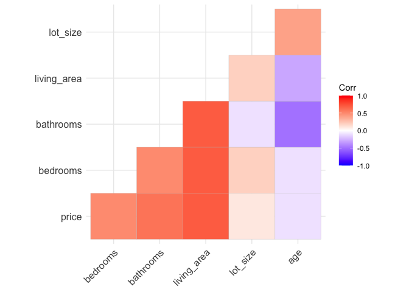
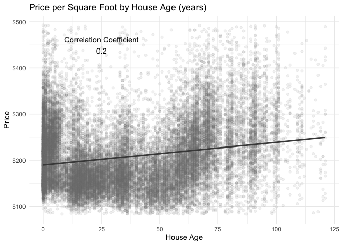
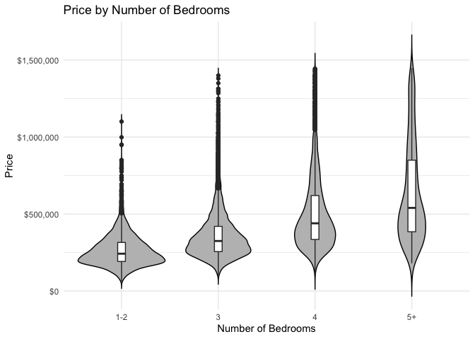
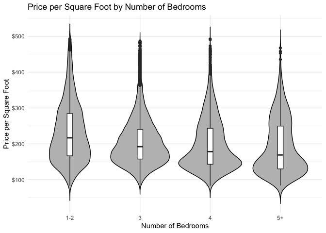
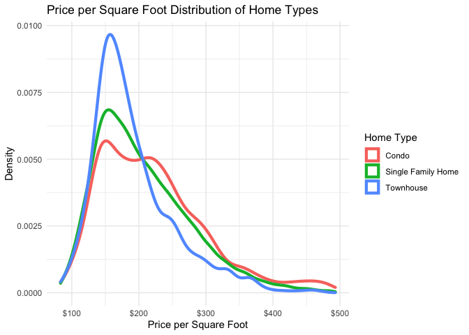
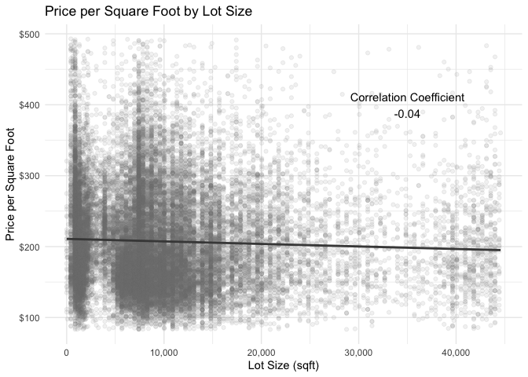

House Features
================
Shea Conaway

``` r
# packages
library(tidyverse)
library(ggcorrplot)
library(scales)
```

``` r
# load data
data <- read_csv("../data_clean/cleaned_data.csv", show_col_types = FALSE)
```

``` r
# turn off scientific notation
options(scipen = 100)
```

# Investigate correlations

``` r
# Correlations plots can help us better visualize correlations between variables

corr_data <- 
  data %>% 
  select(price, bedrooms, bathrooms, living_area, lot_size, age)

corr <- round(cor(corr_data), 1)

ggcorrplot(corr,type = "lower")
```

<!-- -->

# Age

``` r
# correlation between age and price
corr_sqft <- round(cor(data$age, data$price_sqft), 2)

# scatter plot of "age" and "price"
ggplot(data, aes(x = age, y = price_sqft)) +
  geom_point(alpha = 0.1, color = "gray50") +
  geom_smooth(formula = y ~ x, method = 'lm', se = FALSE, color = 'gray28', size = 1) +
  labs(title = "Price per Square Foot by House Age (years)", y = "Price", x = "House Age") +
  annotate('text',label = paste('Correlation Coefficient', corr_sqft, sep = '\n'), x = 25, y = 450) +
  scale_y_continuous(name = 'Price', labels = dollar_format()) +
  theme_minimal()
```

<!-- -->

# Bedrooms

``` r
# basic distribution
data %>% count(bedrooms)
```

    ## # A tibble: 8 × 2
    ##   bedrooms     n
    ##      <dbl> <int>
    ## 1        1   302
    ## 2        2  4781
    ## 3        3 16123
    ## 4        4  6712
    ## 5        5  1003
    ## 6        6    91
    ## 7        7    13
    ## 8        8     3

``` r
# consolidate
data$bedrooms[data$bedrooms <= 2] <- '1-2'
data$bedrooms[data$bedrooms == 2] <- '1-2'
data$bedrooms[data$bedrooms == 3] <- '3'
data$bedrooms[data$bedrooms == 4] <- '4'
data$bedrooms[data$bedrooms >= 5] <- '5+'
```

``` r
# violin plot, price
ggplot(subset(data, data$bedrooms <= 7), aes(x = bedrooms, y = price, group = bedrooms)) + # only three greater than 7
  geom_violin(trim = FALSE, fill = 'grey', color = "black") + 
  geom_boxplot(width = 0.08) +
  labs(title = "Price by Number of Bedrooms"
       ,x = "Number of Bedrooms"
       ,y = 'Price') + 
  scale_y_continuous(labels = dollar_format()) +
  theme_minimal()
```

<!-- -->

``` r
# violin plot, price_sqft
ggplot(subset(data, data$bedrooms <= 7), aes(x = bedrooms, y = price_sqft, group = bedrooms)) + # only three greater than 7
  geom_violin(trim = FALSE, fill = 'grey', color = "black") + 
  geom_boxplot(width = 0.08) +
  labs(title = "Price per Square Foot by Number of Bedrooms"
       ,x = "Number of Bedrooms"
       ,y = 'Price per Square Foot') + 
  scale_y_continuous(labels = dollar_format()) +
  theme_minimal()
```

<!-- -->

# Home Type

``` r
# Rename three home types
data$home_type[data$home_type == 'CONDO'] <- 'Condo'
data$home_type[data$home_type == 'SINGLE_FAMILY'] <- 'Single Family Home'
data$home_type[data$home_type == 'TOWNHOUSE'] <- 'Townhouse'

# densities
ggplot(data,aes(x = price_sqft, group = home_type, color = home_type)) + 
  geom_density(size = 1.5) +
  labs(title = "Price per Square Foot Distribution of Home Types"
       ,x = 'Price per Square Foot'
       ,y = 'Density'
       ,color = 'Home Type') +
  scale_x_continuous(labels = dollar_format()) +
  theme_minimal()
```

<!-- -->

# Lot Size

``` r
# living area and lot size not correlated
cor(data$lot_size, data$living_area)
```

    ## [1] 0.1787275

``` r
# correlation between "living_area" and "price_sqft"
corr_sqft <- round(cor(data$lot_size, data$price_sqft), 2)

# scatter plot of "living_area" and "price_sqft"
ggplot(data, aes(x = lot_size, y = price_sqft)) +
  geom_point(alpha = 0.1, color = "gray50") +
  geom_smooth(formula = y ~ x, method = 'lm', se = FALSE, color = 'gray28', size = 1) +
  labs(title = "Price per Square Foot by Lot Size"
       ,y = "Price per Square Foot"
       ,x = "Lot Size (sqft)") +
  annotate('text',label = paste('Correlation Coefficient', corr_sqft, sep = '\n'), x = 35000, y = 400) +
  scale_y_continuous(labels = dollar_format()) +
  scale_x_continuous(labels = comma) +
  theme_minimal()
```

<!-- -->
