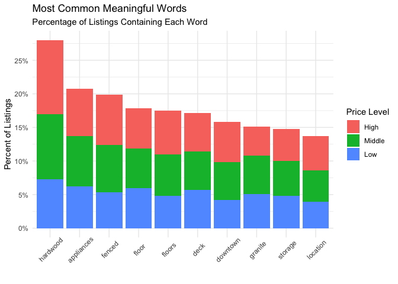
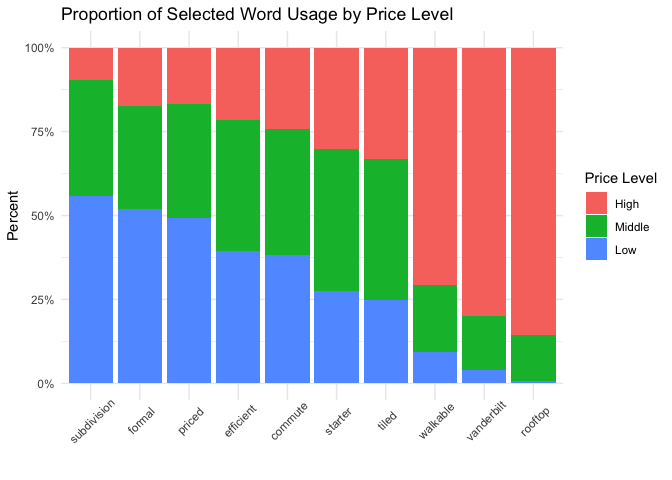
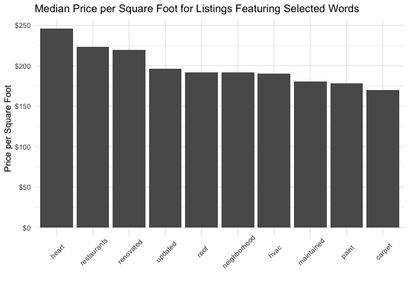
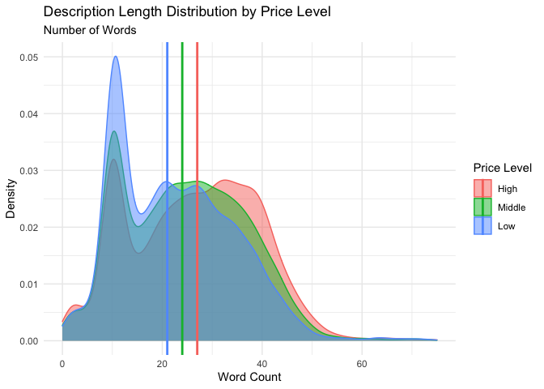

Text Analysis
================
Shea Conaway

``` r
# packages
library(tidyverse)
library(readr)
library(cowplot)
library(tidytext)
library(scales)
```

``` r
# import and prepare data
data <- read_csv("../data_clean/cleaned_data.csv", show_col_types = FALSE)
```

# Stop words

``` r
# english general stop words
stop_words_english <- 
  stop_words %>%
  select(-lexicon) %>%
  unique

# listing stop words
# these are words that don't qualitatively distinguish one listing from another
stop_words_house <- 
  stop_words_english %>%
  bind_rows(data.frame(word = c('zestimate','nashville','home','house','built','master','living','tn','mo'
                                ,'beautiful','sold','rent','level','space','spacious',''# general listing words
                                ,'bedroom','bedrooms','bath','bathroom','bathrooms','family','kitchen','garage','suite' # types and counts of rooms
                                ,'dr','street','st','ave','avenue','trl','drive' # locators
                                ,'yard','car','backyard' # common features
                                ,'1','2','3','4','5','6','ft','sq','single','2018','2019','2.5','1.5' # counts and measurements
                                ,'walk' # ambiguous
                                )))
```

# Prepare data for text analysis

``` r
# tokenize words, count word once per listing
words_all <-
  data %>% 
  mutate(price_level = 'Middle') %>%
  select(zpid,price_sqft,price_level,url,description) %>% 
  unnest_tokens(word, description) %>% 
  unique %>%
  anti_join(stop_words_house, by = 'word') # remove stop words

# set price levels
words_all$price_level[words_all$price_sqft > quantile(data$price_sqft, 0.666)] <- 'High'
words_all$price_level[words_all$price_sqft < quantile(data$price_sqft, 0.333)] <- 'Low'

# factorize
words_all$price_level <- factor(words_all$price_level, c('High','Middle','Low'))

# consolidate like words
words_all$word[words_all$word == 'hardwoods'] <- 'hardwood'
```

# Code for word investigation

Used to look up listing examples of specific words for better context
and understanding

``` r
# investigate

# check word usage
  data %>% 
  select(zpid,price_sqft,url,description) %>% 
  unnest_tokens(word, description) %>% 
  unique %>%
  anti_join(stop_words_house, by = 'word') %>%
  filter(word == 'formal')
```

# Top ten words for all listings

Stop words and words considered inconsequential removed

``` r
# top ten words for all listings
top_ten_words <- 
  words_all %>%
  count(word, sort = TRUE) %>%
  slice(1:10) %>%
  pull(word)

# top ten word proportions
words_all %>%
  filter(word %in% top_ten_words) %>% # top ten words for all listings
  count(word,price_level) %>%
  mutate(word = factor(word, levels = top_ten_words)
         ,listings_with = n/nrow(data)) %>% # calculate portion of listings
ggplot(aes(fill=price_level, y = listings_with, x = word)) +
  geom_bar(position = 'stack', stat = 'identity') +
  labs(title = 'Most Common Meaningful Words'
       ,subtitle = 'Percentage of Listings Containing Each Word'
       ,x = ''
       ,y = 'Percent of Listings') +
  scale_y_continuous(labels = percent_format(scale = 100, accuracy = 1), breaks = seq(0,0.3,0.05)) +
  scale_fill_discrete(name = 'Price Level') +
  theme_minimal() +
  theme(axis.text.x = element_text(angle = 45, hjust = 0.5, vjust = 0.75))
```

<!-- -->

# Price level proportion for selected words

## Lookup code

Used to look up selected words for price impact

``` r
# frequency of words within price levels
words_freq <-
  words_all %>%
  group_by(word,price_level) %>%
  summarize(n = n(), .groups = 'drop_last') %>%
  mutate(freq = n / sum(n))

# pick high price words
words_freq %>% 
  filter(price_level == 'High') %>% 
  filter(n > 100) %>% # limit to words in at least 5% of listings
  arrange(desc(freq))

# pick middle price words
words_freq %>% 
  filter(price_level == 'Middle') %>% 
  filter(n > 100) %>% # limit to words in at least 5% of listings
  arrange(desc(freq))

# pick low price words
words_freq %>% 
  filter(price_level == 'Low') %>% 
  filter(n > 100) %>% # limit to words in at least 5% of listings
  arrange(desc(freq)) 
```

``` r
# price sensitive words
price_words <- c('subdivision','formal','priced','efficient','commute','starter','tiled','walkable','vanderbilt','rooftop')

# frequency of price sensitive words
words_all %>%
  filter(word %in% price_words) %>%
  count(word,price_level) %>%
  mutate(word = factor(word, levels = price_words)) %>%
ggplot(aes(fill=price_level, y = n, x = word)) +
  geom_bar(position = 'fill', stat = 'identity') +
  labs(title = 'Proportion of Selected Word Usage by Price Level'
       ,x = ''
       ,y = 'Percent') +
  scale_y_continuous(labels = percent_format(scale = 100, accuracy = 1)) +
  scale_fill_discrete(name = 'Price Level') +
  theme_minimal() +
  theme(axis.text.x = element_text(angle = 45, hjust = 0.5, vjust = 0.75))
```

<!-- -->

# Median price for listings with selected words

``` r
# word by median square foot
words_median_price <-
  words_all %>%
  group_by(word) %>%
  summarize(n = n(), med_price_sqft = median(price_sqft)) %>%
  filter(n > 0.05*nrow(data)) %>% # limit to words in at least 5% of listings
  arrange(desc(med_price_sqft))
```

## Lookup code

Used to select words at different price levels

``` r
# select words

# highest
words_median_price %>%
  arrange(desc(med_price_sqft)) %>%
  slice(1:10)

# middle
middle <- quantile(words_median_price$med_price_sqft,probs = c(0.35,0.65))
words_median_price %>%
  filter(between(med_price_sqft,middle[1],middle[2]))

# lowest
words_median_price %>%
  arrange(med_price_sqft) %>%
  slice(1:15)
```

``` r
# selected high, middle, and low words
selected_median_price_words <- c('heart','renovated','restaurants','neighborhood','hvac','roof','updated','carpet','paint','maintained')

words_median_price %>%
  filter(word %in% selected_median_price_words) %>%
ggplot(aes(x = reorder(word, med_price_sqft, function(med_price_sqft) -med_price_sqft), y = med_price_sqft)) +
  geom_bar(stat = 'identity') +
  labs(title = 'Median Price per Square Foot for Listings Featuring Selected Words'
       ,x = ''
       ,y = 'Price per Square Foot') +
  scale_y_continuous(labels = dollar_format()) +
  theme_minimal() +
  theme(axis.text.x = element_text(angle = 45, hjust = 0.5, vjust = 0.75))
```

<!-- -->

## Unique word count by price level

``` r
median_words <-
  words_all %>%
  count(price_level,zpid) %>%
  group_by(price_level) %>%
  summarize(median_words = median(n))

words_all %>%
  count(price_level,zpid) %>%
ggplot(aes(x = n, group = price_level, color = price_level, fill = price_level)) +
  geom_density(alpha = 0.5) +
  geom_vline(data = median_words, aes(xintercept = median_words,color = price_level), size= 1) +
  xlim(0,75) +
  labs(title = 'Description Length Distribution by Price Level'
       ,subtitle = 'Number of Words'
       ,x = 'Word Count'
       ,y = 'Density') +
  scale_fill_discrete(name = 'Price Level') +
  scale_color_discrete(name = 'Price Level') +
  theme_minimal()
```

<!-- -->
