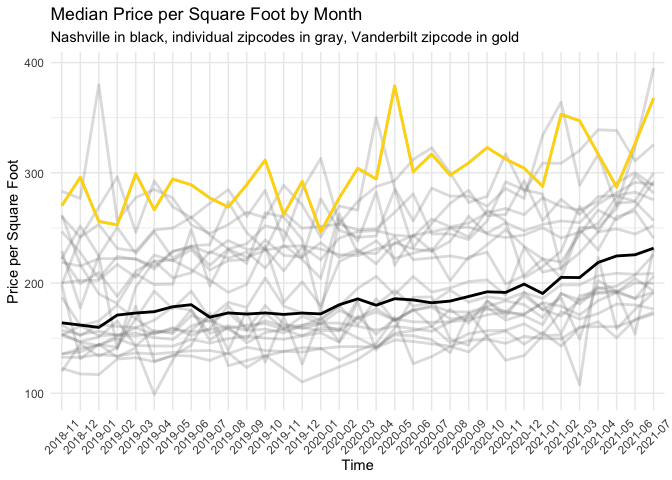
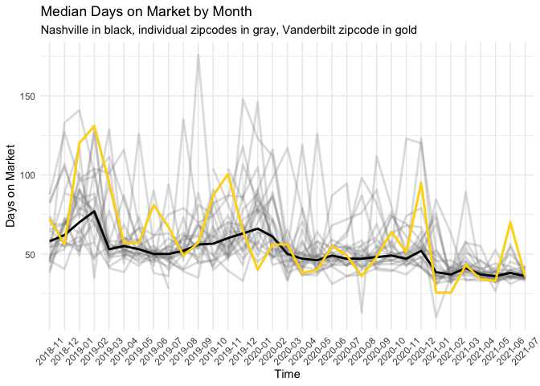
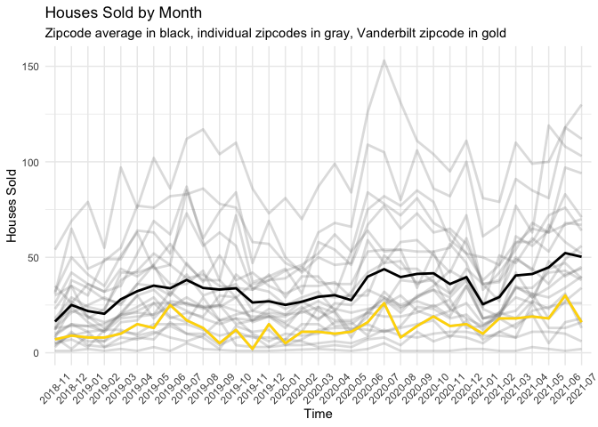
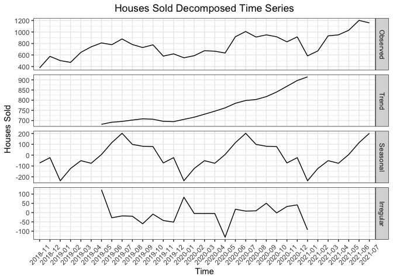

Time Trends in Price and Sales
================
Shea Conaway

``` r
# packages
library(tidyverse)
library(cowplot)
```

``` r
# import data
data <- read_csv('../data_clean/cleaned_data.csv', show_col_types = FALSE)
```

``` r
# data prep

# medians by zipcode
data_all_area <- 
  data %>%
  filter(address_zipcode != 37219 & address_zipcode != 37201) %>% # too few observations
  mutate(date_month = format(as.Date(date_sold),format = "%Y-%m")) %>%
  group_by(address_zipcode, date_month) %>%
  summarize(median_price_sqft = median(price_sqft)
            ,median_days = median(days_on_market, na.rm = TRUE)
            ,sold_count = n()) %>%
  arrange(address_zipcode,date_month) %>%
  filter(date_month <= '2021-07') %>% # remove last few months,  house sales not finalized
  ungroup()
  
# medians for all Nashville
data_nashville <- 
  data %>%
  mutate(date_month = format(as.Date(date_sold),format = "%Y-%m")) %>%
  group_by(date_month) %>%
  summarize(median_price_sqft = median(price_sqft)
            ,median_days = median(days_on_market, na.rm = TRUE)
            ,sold_count = n()) %>%
  arrange(date_month) %>%
  filter(date_month <= '2021-07') %>% # remove last few months,  house sales not finalized
  ungroup()
```

## Time Trends by Zip Code

``` r
# plot
ggplot(data = data_all_area,
       aes(x = date_month, y = median_price_sqft, group = address_zipcode)) +
  geom_line(alpha = 0.25, size = 1, color = "gray50") + # zipcode lines
  geom_line(data = data_nashville,
            aes(x = date_month, y = median_price_sqft, group = 1), size = 1) + # nashville
  geom_line(data = subset(data_all_area, address_zipcode == 37212), size = 1, color = "gold") + # VU zip
  theme_minimal() +
  labs(title = 'Median Price per Square Foot by Month',
       subtitle = 'Nashville in black, individual zipcodes in gray, Vanderbilt zipcode in gold',
       x = "Time",
       y = "Price per Square Foot") +
  theme(axis.text.x = element_text(angle = 45, hjust = 0.5, vjust = 0.5))
```

<!-- -->

``` r
# plot
ggplot(data = data_all_area,
       aes(x = date_month, y = median_days, group = address_zipcode)) +
  geom_line(alpha = 0.25, size = 1, color = "gray50") + # zipcode lines
  geom_line(data = data_nashville,
            aes(x = date_month, y = median_days, group = 1), size = 1) + # nashville
  geom_line(data = subset(data_all_area, address_zipcode == 37212), size = 1, color = "gold") + # VU zip
  theme_minimal() +
  labs(title = 'Median Days on Market by Month',
       subtitle = 'Nashville in black, individual zipcodes in gray, Vanderbilt zipcode in gold',
       x = "Time",
       y = "Days on Market") +
  theme(axis.text.x = element_text(angle = 45, hjust = 0.5, vjust = 0.5))
```

<!-- -->

``` r
# zip average
data_avg_sold <-
  data_all_area %>%
  group_by(date_month) %>%
  summarize(avg_sold = mean(sold_count))

# plot
ggplot(data = data_all_area
       ,aes(x = date_month, y = sold_count, group = address_zipcode)) +
  geom_line(alpha = 0.25, size = 1, color = "gray50") + # zipcode lines
  geom_line(data = data_avg_sold,
            aes(x = date_month, y = avg_sold, group = 1), size = 1) + # nashville
  geom_line(data = subset(data_all_area, address_zipcode == 37212), size = 1, color = "gold") + # VU zip
  theme_minimal() +
  labs(title = 'Houses Sold by Month',
       subtitle = 'Zipcode average in black, individual zipcodes in gray, Vanderbilt zipcode in gold',
       x = "Time",
       y = "Houses Sold") +
  theme(axis.text.x = element_text(angle = 45, hjust = 0.5, vjust = 0.5))
```

<!-- -->

## Time Series Analysis

``` r
# Create median price per sqft time series
data_ts_price <- 
  data_nashville %>%
  select(date_month,median_price_sqft)

tseries <- ts(data_ts_price$median_price_sqft, start = c(2018,11), frequency = 12)
components.ts = decompose(tseries) 

Time = attributes(tseries)[[1]]
Time = seq(Time[1],Time[2], length.out=(Time[2]-Time[1])*Time[3])

dat = cbind(Time, with(components.ts, data.frame(Observed=x, Trend=trend, Seasonal=seasonal, Irregular=random)))
month = data_ts_price$date_month
dat <- dat %>%
  gather(component, value, -Time) %>%
  cbind(month = rep(month, 4))

# order componenets
dat$component <- factor(dat$component, c('Observed','Trend','Seasonal','Irregular'))

ggplot(dat, aes(x = month, y = value, group = 1)) +
  facet_grid(component ~ ., scales = "free_y") +
  geom_line() +
  theme_bw() +
  labs(y="Median Price per Square Foot", x="Time") +
  ggtitle("Median Price per Square Foot Decomposed Time Series") +
  theme(plot.title=element_text(hjust=0.5),
        axis.text.x = element_text(angle = 45, hjust = 0.5, vjust = 0.5))
```

<!-- -->

``` r
# Create median days on market time series
data_ts_days <- 
  data_nashville %>%
  select(date_month,median_days)

tseries <- ts(data_ts_days$median_days, start = c(2018,11), frequency = 12)
components.ts = decompose(tseries) 

Time = attributes(tseries)[[1]]
Time = seq(Time[1],Time[2], length.out=(Time[2]-Time[1])*Time[3])

dat = cbind(Time, with(components.ts, data.frame(Observed=x, Trend=trend, Seasonal=seasonal, Irregular=random)))
month = data_ts_price$date_month
dat <- dat %>%
  gather(component, value, -Time) %>%
  cbind(month = rep(month, 4))

# order componenets
dat$component <- factor(dat$component, c('Observed','Trend','Seasonal','Irregular'))

ggplot(dat, aes(x = month, y = value, group = 1)) +
  facet_grid(component ~ ., scales="free_y") +
  geom_line() +
  theme_bw() +
  labs(y="Median Days on Market", x="Time") +
  ggtitle("Median Days on Market Decomposed Time Series") +
  theme(plot.title=element_text(hjust=0.5),
        axis.text.x = element_text(angle = 45, hjust = 0.5, vjust = 0.5))
```

<!-- -->

``` r
# Create houses sold amount time series
data_ts_sold <- 
  data_nashville %>%
  select(date_month,sold_count)

tseries <- ts(data_ts_sold$sold_count, start = c(2018,11), frequency = 12)
components.ts = decompose(tseries) 

Time = attributes(tseries)[[1]]
Time = seq(Time[1],Time[2], length.out=(Time[2]-Time[1])*Time[3])

dat = cbind(Time, with(components.ts, data.frame(Observed=x, Trend=trend, Seasonal=seasonal, Irregular=random)))
month = data_ts_price$date_month
dat <- dat %>%
  gather(component, value, -Time) %>%
  cbind(month = rep(month, 4))

# order componenets
dat$component <- factor(dat$component, c('Observed','Trend','Seasonal','Irregular'))

ggplot(dat, aes(x = month, y = value, group = 1)) +
  facet_grid(component ~ ., scales="free_y") +
  geom_line() +
  theme_bw() +
  labs(y="Houses Sold", x="Time") +
  ggtitle("Houses Sold Decomposed Time Series") +
  theme(plot.title=element_text(hjust=0.5),
        axis.text.x = element_text(angle = 45, hjust = 0.5, vjust = 0.5))
```

<!-- -->
