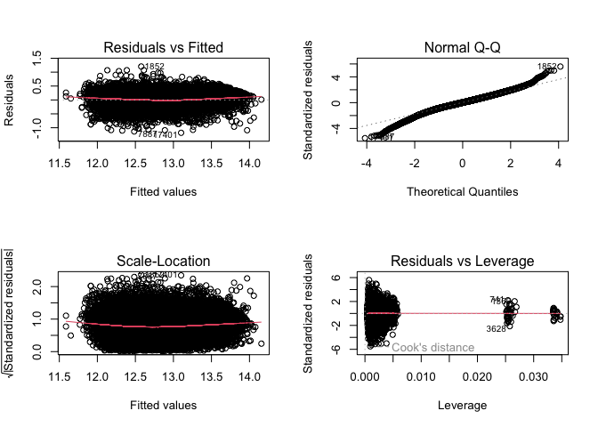

Modeling
================
Shea Conaway

``` r
# markdown-wide packages
```

# Data

``` r
# data
df <- read.csv('../data/2_cleaned/cleaned_data.csv')
```

``` r
# one-hot encode categoricals

# home type
# default single family
# encode condo or townhouse
df$condo <- ifelse(df$home_type == 'CONDO', 1, 0)
df$townhouse <- ifelse(df$home_type == 'TOWNHOUSE', 1, 0)

# neighborhood
# default neighborhood 1 (Green Hills / Forest Hills / Belle Meade)
neighborhoods <- unique(df$neighborhood)
num_hoods <- length(neighborhoods) # 24
# loop enconding
for(i in 2:num_hoods) {
  new <- ifelse(df$neighborhood == neighborhoods[i], 1, 0)
  df[ , ncol(df) + 1] <- new
  colnames(df)[ncol(df)] <- paste0('neighborhood_', i) 
  }
```

``` r
# subset to desired variables
df <- subset(df,select = -c(zpid
                   ,price_sqft
                   ,home_type
                   ,date_sold
                   ,date_listed
                   ,days_on_market
                   ,date_sold_previous
                   ,age
                   ,year_built
                   ,description
                   ,photo_count
                   #,longitude
                   #,latitude
                   ,neighborhood
                   ,address_state
                   ,address_city
                   ,address_zipcode
                   ,address_street
                   ,parcel_id
                   ,url
                   ,favorite_count
                   ,page_view_count
                   ,home_status))
```

``` r
# a little additional lot size cleaning
# lot size should be at least as large as living area
df$lot_size[df$lot_size < df$living_area] <- df$living_area[df$lot_size < df$living_area]
```

# Model

## Linear Regression

Linear regression models are well-understood and easily explained. They
serve as a good baseline model in a regression task to gut-check more
sophisticated approaches.

The target variable distribution is right skewed, as expected with home
prices. The log transformation does a decent job of normalizing, which
is more appropriate for a linear model. Log transformations are also
applied to the skewed features.

``` r
summary(df$price)
```

    ##    Min. 1st Qu.  Median    Mean 3rd Qu.    Max. 
    ##   62000  255000  335000  388684  452500 1449000

``` r
d = density(df$price)
plot(d, main = 'price')
polygon(d, col='gray')
```

<!-- -->

``` r
d_log = density(log(df$price))
plot(d_log, main = 'price')
polygon(d_log, col='gray')
```

<!-- -->

``` r
# feature log transformations
df$bedrooms <- log(df$bedrooms)
df$bathrooms <- log(df$bathrooms)
df$living_area <- log(df$living_area)
df$lot_size <- log(df$lot_size)
```

We split our data in train/validate/test sets. The train dataset is used
for fitting our models. Validate is used for comparing models. While
train and validate will be used multiple times, our final test set is
used only once to estimate real-world performance.

``` r
# train/validate/test split
library(splitTools)
set.seed(20221217)

# 80/10/10
inds <- splitTools::partition(df$price, p = c(train = 0.6, valid = 0.1, test = 0.1))
str(inds)
```

    ## List of 3
    ##  $ train: int [1:21762] 1 4 5 6 7 8 9 10 11 14 ...
    ##  $ valid: int [1:3632] 2 12 13 26 34 37 75 89 96 106 ...
    ##  $ test : int [1:3634] 3 15 27 32 42 45 46 49 50 61 ...

``` r
train <- df[inds$train, ]
valid <- df[inds$valid, ]
test <- df[inds$test, ]
```

``` r
# linear model training
model_lm = lm(log(price) ~ ., data=train)
summary(model_lm)
```

    ## 
    ## Call:
    ## lm(formula = log(price) ~ ., data = train)
    ## 
    ## Residuals:
    ##      Min       1Q   Median       3Q      Max 
    ## -1.18276 -0.12323  0.00418  0.13476  1.20313 
    ## 
    ## Coefficients:
    ##                  Estimate Std. Error t value Pr(>|t|)    
    ## (Intercept)     97.745581   6.060261  16.129  < 2e-16 ***
    ## bedrooms        -0.009329   0.008538  -1.093  0.27457    
    ## bathrooms        0.185869   0.006113  30.407  < 2e-16 ***
    ## living_area      0.577855   0.007429  77.787  < 2e-16 ***
    ## lot_size         0.031893   0.002515  12.683  < 2e-16 ***
    ## downtown_dist   -0.044007   0.001137 -38.710  < 2e-16 ***
    ## longitude        0.414216   0.062850   6.591 4.48e-11 ***
    ## latitude        -1.472723   0.079236 -18.587  < 2e-16 ***
    ## condo           -0.062745   0.006419  -9.775  < 2e-16 ***
    ## townhouse       -0.107654   0.007321 -14.705  < 2e-16 ***
    ## neighborhood_2  -0.407485   0.011756 -34.661  < 2e-16 ***
    ## neighborhood_3  -0.239006   0.013121 -18.215  < 2e-16 ***
    ## neighborhood_4   0.019676   0.015845   1.242  0.21434    
    ## neighborhood_5  -0.088929   0.010707  -8.306  < 2e-16 ***
    ## neighborhood_6  -0.316788   0.018726 -16.917  < 2e-16 ***
    ## neighborhood_7  -0.289468   0.014258 -20.302  < 2e-16 ***
    ## neighborhood_8  -0.298727   0.013871 -21.536  < 2e-16 ***
    ## neighborhood_9  -0.347913   0.015205 -22.881  < 2e-16 ***
    ## neighborhood_10 -0.527059   0.015296 -34.458  < 2e-16 ***
    ## neighborhood_11 -0.141440   0.016654  -8.493  < 2e-16 ***
    ## neighborhood_12 -0.288369   0.019056 -15.133  < 2e-16 ***
    ## neighborhood_13 -0.461339   0.016595 -27.800  < 2e-16 ***
    ## neighborhood_14 -0.177319   0.021053  -8.423  < 2e-16 ***
    ## neighborhood_15 -0.576850   0.016024 -36.000  < 2e-16 ***
    ## neighborhood_16 -0.098605   0.014782  -6.670 2.61e-11 ***
    ## neighborhood_17  0.023912   0.012047   1.985  0.04717 *  
    ## neighborhood_18 -0.104295   0.013082  -7.972 1.63e-15 ***
    ## neighborhood_19  0.054666   0.013228   4.132 3.60e-05 ***
    ## neighborhood_20 -0.393750   0.015539 -25.340  < 2e-16 ***
    ## neighborhood_21  0.077522   0.014253   5.439 5.41e-08 ***
    ## neighborhood_22 -0.162077   0.040318  -4.020 5.84e-05 ***
    ## neighborhood_23 -0.156763   0.017796  -8.809  < 2e-16 ***
    ## neighborhood_24  0.122519   0.040936   2.993  0.00277 ** 
    ## ---
    ## Signif. codes:  0 '***' 0.001 '**' 0.01 '*' 0.05 '.' 0.1 ' ' 1
    ## 
    ## Residual standard error: 0.2152 on 21729 degrees of freedom
    ## Multiple R-squared:  0.7781, Adjusted R-squared:  0.7778 
    ## F-statistic:  2382 on 32 and 21729 DF,  p-value: < 2.2e-16

It is good practice to check for multicollinearity in the predictors for
a linear model, as the presence of relationships between the predictors
can make coefficients and their p-values unreliable. Here, we have some
severe variance inflaction factor scores for variables having to do with
location.

Given that our primary interest is in prediction performance, rather
than the independent relationship between each predictor and the price
target, we can leave this issue unaddressed.

``` r
# check for multicollinearity in our predictors
library(car) # variance inflation factor
```

    ## Loading required package: carData

``` r
vif <- car::vif(model_lm) # variance inflation factor
vif[vif > 5] # severe
```

    ##   downtown_dist       longitude        latitude  neighborhood_2  neighborhood_6 
    ##        7.907548       18.444286       15.022280        5.865642       11.544099 
    ##  neighborhood_8 neighborhood_10 neighborhood_11 neighborhood_12 neighborhood_14 
    ##        5.032633       12.242618        8.444304        7.040319        6.906078 
    ## neighborhood_20 
    ##        5.708727

In our diagnostic plots, we’re assessing the assumptions we’ve made in a
linear model. - In the Residuals vs Fitted plot, we’re seeing a stable
goodness of fit for most of the fitted value range, with some issues at
the tails. In particular, the spread of residuals noticeably shifts at
the upper end. There are also clear outliers. - In our Normal QQ-plot,
we’re seeing a deviation that indicates non-normality in our response
variable. We addressed this problem with a log transformation of price,
but the tails are still fat. - The Scale-Location plot mainly serves to
confirm the concerns about heteroskedasticity at higher prices. - The
Residuals vs Leverage plot reveals a relationship between our errors and
the leverage, or degree of influence of our points. Interestingly there
are clusters of leverage with decreasing spread of residuals. Here it
appears that our higher-leverage observations are not causing problems
with our fit.

``` r
# linear regression diagnostic plots
par(mfrow=c(2,2))
plot(model_lm)
```

<!-- -->

``` r
# linear regression prediction and root mean squared error
pred_lm <- predict(model_lm, newdata = valid)
rmse_lm <- sqrt(sum((exp(pred_lm) - valid$price)^2)/length(valid$price))
rmse_lm
```

    ## [1] 96678.3

In this plot of actual vs predicted, the model performs better for lower
cost housing.

Over \$700,000 the model appears to underestimate prices. Only 8% of the
houses are in this range. For more expensive houses, there are likely
characteristics we don’t have in our data that capture some of their
value. Think luxury features like hardwood floors, expensive lighting
fixtures, ensuite bathrooms, etc.

``` r
# plot
plot(valid$price, exp(pred_lm))
abline(coef = c(0, 1), c = 'red')
```

<!-- -->

``` r
sum(df$price > 700000)/length(df$price)
```

    ## [1] 0.07820036

## XGBoost

``` r
# xgboost package
library(xgboost) 
```

XGBoost belongs to a class of models popular throughout many industries
because of superior performance on a variety problems. Its benefits
include capturing non-linear relationships, detecing complex
interactions, and robustness to outliers and other data issues.

An XGBoost model consists of many weak classifiers trained iteratively
to reduce residuals, also known as boosting. This decision-tree based
ensemble algorithm uses the gradient boosting framework, which allows
for flexibility in loss function selection.

``` r
# additional xgboost data formatting

# train
train_x = data.matrix(train[, -1])
train_y = train[,1]
# test
valid_x = data.matrix(valid[, -1])
valid_y = valid[,1]
# final format for xgboost
xgb_train = xgb.DMatrix(data = train_x, label = train_y)
xgb_valid = xgb.DMatrix(data = valid_x, label = valid_y)
```

``` r
# xgboost training
model_xgb = xgb.train(data = xgb_train, max.depth = 3, nrounds = 350)
```

``` r
# xgb prediction and root mean squared error
pred_xgb <- predict(model_xgb, newdata = valid_x)
rmse_xgb <- sqrt(sum((pred_xgb - valid$price)^2)/length(valid$price))
rmse_xgb
```

    ## [1] 85450.26

XGBoost results in a 12% reduction in RMSE.

Although not as severe, it is still underestimating more expensive
homes.

``` r
# plot
plot(valid$price, pred_xgb)
abline(coef = c(0, 1), c = 'red')
```

<!-- -->

``` r
1 - rmse_xgb/rmse_lm # performance comparison
```

    ## [1] 0.1161382

# Test

Once we’ve settled on our modeling decisions, we can train our test
model on all the non-test data and assess real-world performance on the
test set. I’m not ready to do this yet.

``` r
# test model training

# model_test = model(price ~ ., data=(train + valid))
```

``` r
# final model prediction and root mean squared error

# pred_test <- predict(model_test, newdata = test)
# rmse_test <- sqrt(sum(pred_test - test$price)^2)/length(test$price))
# rmse_test
```

# Final Model

When it’s all said and done, we can train our final model on all the
data we have. Then we’re ready to use our model to price some houses!

``` r
# final model training

# model_final = model(price ~ ., data=df)
```
