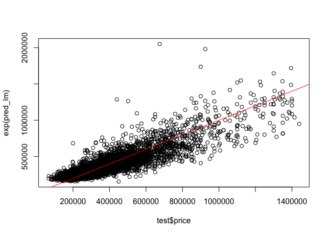
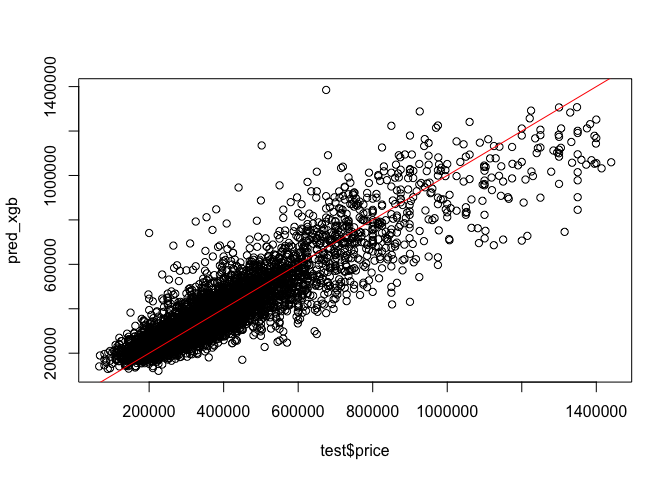

Modeling
================
Shea Conaway

``` r
# packages
library(xgboost) #for fitting the xgboost model
library(caret) # data prep and model fitting
```

# Data

``` r
# data
df <- read.csv('../data/2_cleaned/cleaned_data.csv')
```

``` r
# one-hot encode categoricals

# home type
# default single family
# encode condo or townhouse
df$condo <- ifelse(df$home_type == 'CONDO', 1, 0)
df$townhouse <- ifelse(df$home_type == 'TOWNHOUSE', 1, 0)

# neighborhood
# default neighborhood 1 (Green Hills / Forest Hills / Belle Meade)
neighborhoods <- unique(df$neighborhood)
num_hoods <- length(neighborhoods) # 24
# loop enconding
for(i in 2:num_hoods) {
  new <- ifelse(df$neighborhood == neighborhoods[i], 1, 0)
  df[ , ncol(df) + 1] <- new
  colnames(df)[ncol(df)] <- paste0('neighborhood_', i) 
  }
```

``` r
# subset to desired variables
df <- subset(df,select = -c(zpid
                   ,price_sqft
                   ,home_type
                   ,date_sold
                   ,date_listed
                   ,days_on_market
                   ,date_sold_previous
                   ,age
                   ,year_built
                   ,description
                   ,photo_count
                   ,longitude
                   ,latitude
                   ,neighborhood
                   ,address_state
                   ,address_city
                   ,address_zipcode
                   ,address_street
                   ,parcel_id
                   ,url
                   ,favorite_count
                   ,page_view_count
                   ,home_status))
```

``` r
# train/test split
set.seed(20221217)

# 80/20
parts = caret::createDataPartition(df$price, p = .8, list = F)
train = df[parts, ]
test = df[-parts, ]

dim(train)
```

    ## [1] 23224    31

``` r
dim(test)
```

    ## [1] 5804   31

# Model

## Linear Regression

Linear regression models are well-understood and easily explained. They
serve as a good baseline model in a regression task to gut-check more
sophisticated approaches.

### Train

The target variable distribution is right skewed, as expected with home
prices. The log transformation does a decent job of normalizing, which
is more appropriate for a linear model.

``` r
d = density(train$price)
plot(d, main = 'price')
polygon(d, col='gray')
```

<!-- -->

``` r
d_log = density(log(train$price))
plot(d_log, main = 'price')
polygon(d_log, col='gray')
```

<!-- -->

``` r
# linear model training
model_lm = lm(log(price) ~ ., data=train)
summary(model_lm)
```

    ## 
    ## Call:
    ## lm(formula = log(price) ~ ., data = train)
    ## 
    ## Residuals:
    ##      Min       1Q   Median       3Q      Max 
    ## -1.35287 -0.12453  0.00719  0.13963  1.29593 
    ## 
    ## Coefficients:
    ##                   Estimate Std. Error  t value Pr(>|t|)    
    ## (Intercept)      1.242e+01  1.230e-02 1009.882  < 2e-16 ***
    ## bedrooms         7.255e-03  2.811e-03    2.581  0.00985 ** 
    ## bathrooms        1.050e-01  2.698e-03   38.940  < 2e-16 ***
    ## living_area      2.684e-04  3.688e-06   72.771  < 2e-16 ***
    ## lot_size         1.836e-06  2.095e-07    8.763  < 2e-16 ***
    ## downtown_dist   -3.153e-02  1.045e-03  -30.165  < 2e-16 ***
    ## condo           -9.817e-02  5.676e-03  -17.295  < 2e-16 ***
    ## townhouse       -1.284e-01  6.814e-03  -18.847  < 2e-16 ***
    ## neighborhood_2  -2.616e-01  1.068e-02  -24.493  < 2e-16 ***
    ## neighborhood_3  -2.666e-01  1.245e-02  -21.418  < 2e-16 ***
    ## neighborhood_4   7.441e-02  1.587e-02    4.688 2.78e-06 ***
    ## neighborhood_5  -1.017e-01  1.020e-02   -9.974  < 2e-16 ***
    ## neighborhood_6  -3.112e-01  1.184e-02  -26.281  < 2e-16 ***
    ## neighborhood_7  -1.523e-01  1.349e-02  -11.294  < 2e-16 ***
    ## neighborhood_8  -3.728e-01  1.094e-02  -34.059  < 2e-16 ***
    ## neighborhood_9  -2.885e-01  1.430e-02  -20.178  < 2e-16 ***
    ## neighborhood_10 -3.657e-01  1.234e-02  -29.640  < 2e-16 ***
    ## neighborhood_11 -1.628e-01  1.286e-02  -12.660  < 2e-16 ***
    ## neighborhood_12 -4.375e-01  1.207e-02  -36.255  < 2e-16 ***
    ## neighborhood_13 -5.415e-01  1.546e-02  -35.015  < 2e-16 ***
    ## neighborhood_14 -3.090e-01  1.335e-02  -23.142  < 2e-16 ***
    ## neighborhood_15 -4.633e-01  1.319e-02  -35.129  < 2e-16 ***
    ## neighborhood_16 -1.406e-01  1.106e-02  -12.709  < 2e-16 ***
    ## neighborhood_17  2.918e-02  1.192e-02    2.447  0.01439 *  
    ## neighborhood_18 -9.184e-02  1.079e-02   -8.510  < 2e-16 ***
    ## neighborhood_19  1.147e-01  1.305e-02    8.791  < 2e-16 ***
    ## neighborhood_20 -3.745e-01  1.132e-02  -33.079  < 2e-16 ***
    ## neighborhood_21  1.097e-01  1.414e-02    7.760 8.86e-15 ***
    ## neighborhood_22 -4.128e-01  4.270e-02   -9.669  < 2e-16 ***
    ## neighborhood_23 -5.162e-03  1.767e-02   -0.292  0.77016    
    ## neighborhood_24  1.540e-02  4.447e-02    0.346  0.72908    
    ## ---
    ## Signif. codes:  0 '***' 0.001 '**' 0.01 '*' 0.05 '.' 0.1 ' ' 1
    ## 
    ## Residual standard error: 0.2247 on 23193 degrees of freedom
    ## Multiple R-squared:  0.7606, Adjusted R-squared:  0.7603 
    ## F-statistic:  2456 on 30 and 23193 DF,  p-value: < 2.2e-16

## Test

``` r
# linear regression prediction and error
pred_lm <- predict(model_lm, newdata = test)
rmse_lm <- sqrt(sum((exp(pred_lm) - test$price)^2)/length(test$price))
rmse_lm
```

    ## [1] 97979.64

``` r
# plot
plot(test$price, exp(pred_lm))
abline(coef = c(0, 1), c = 'red')
```

<!-- -->

## XGBoost

XGBoost belongs to a class of models popular throughout many industries
because of its performance on a variety problems. It is a
decision-tree-based ensemble algorithm that uses the gradient boosting
framework. Most boosting algorithms consist of iteratively learning weak
classifiers to reduce residuals. A gradient-boosted trees model
generalizes this method by allowing optimization of an arbitrary
differentiable loss function.

``` r
# additional xgboost data formatting

# train
train_x = data.matrix(train[, -1])
train_y = train[,1]
# test
test_x = data.matrix(test[, -1])
test_y = test[,1]
# final format for xgboost
xgb_train = xgb.DMatrix(data = train_x, label = train_y)
xgb_test = xgb.DMatrix(data = test_x, label = test_y)
```

``` r
# xgboost training
model_xgb = xgb.train(data = xgb_train, max.depth = 3, nrounds = 350)
```

``` r
# xgb prediction and error
pred_xgb <- predict(model_xgb, newdata = test_x)
rmse_xgb <- caret::RMSE(test_y, pred_xgb)
rmse_xgb
```

    ## [1] 85377

``` r
# plot
plot(test$price, pred_xgb)
abline(coef = c(0, 1), c = 'red')
```

<!-- -->

# Comparison

XGBoost results in a 13% reduction in RMSE.

``` r
# performance comparison
1 - rmse_xgb/rmse_lm
```

    ## [1] 0.1286252
