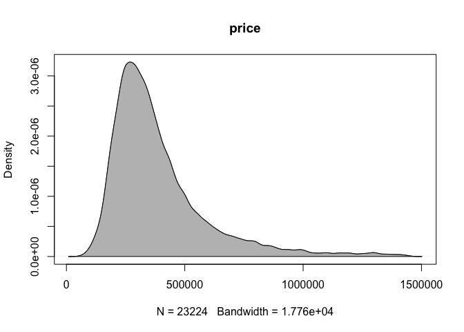
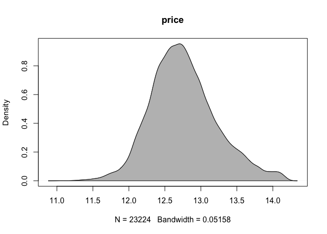
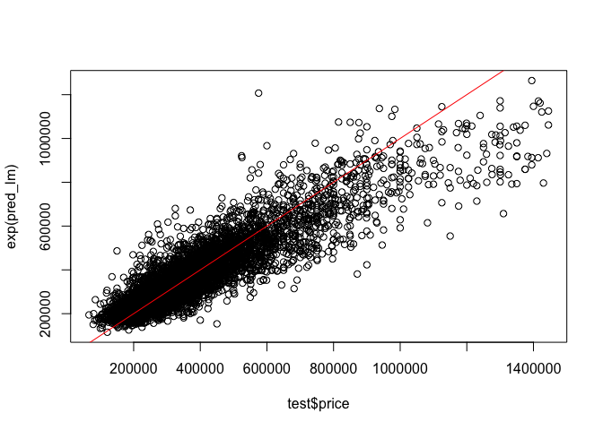
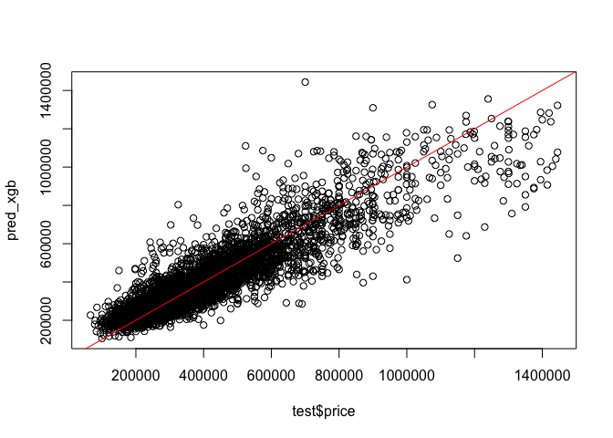

Modeling
================
Shea Conaway

``` r
# packages
library(xgboost) #for fitting the xgboost model
library(caret) # data prep and model fitting
```

# Data

``` r
# data
df <- read.csv('../data/2_cleaned/cleaned_data.csv')
```

``` r
# one-hot encode categoricals

# home type
# default single family
# encode condo or townhouse
df$condo <- ifelse(df$home_type == 'CONDO', 1, 0)
df$townhouse <- ifelse(df$home_type == 'TOWNHOUSE', 1, 0)

# neighborhood
# default neighborhood 1 (Green Hills / Forest Hills / Belle Meade)
neighborhoods <- unique(df$neighborhood)
num_hoods <- length(neighborhoods) # 24
# loop enconding
for(i in 2:num_hoods) {
  new <- ifelse(df$neighborhood == neighborhoods[i], 1, 0)
  df[ , ncol(df) + 1] <- new
  colnames(df)[ncol(df)] <- paste0('neighborhood_', i) 
  }
```

``` r
# subset to desired variables
df <- subset(df,select = -c(zpid
                   ,price_sqft
                   ,home_type
                   ,date_sold
                   ,date_listed
                   ,days_on_market
                   ,date_sold_previous
                   ,age
                   ,year_built
                   ,description
                   ,photo_count
                   #,longitude
                   #,latitude
                   ,neighborhood
                   ,address_state
                   ,address_city
                   ,address_zipcode
                   ,address_street
                   ,parcel_id
                   ,url
                   ,favorite_count
                   ,page_view_count
                   ,home_status))
```

``` r
# a little additional lot size cleaning
df <- df[!df$lot_size == 0,]
df <- df[!df$lot_size == 1,]
# lot size should be at least as large as living area
df$lot_size[df$lot_size < df$living_area] <- df$living_area[df$lot_size < df$living_area]
```

# Model

## Linear Regression

Linear regression models are well-understood and easily explained. They
serve as a good baseline model in a regression task to gut-check more
sophisticated approaches.

The target variable distribution is right skewed, as expected with home
prices. The log transformation does a decent job of normalizing, which
is more appropriate for a linear model. Log transformations are also
applied to the skewed features.

``` r
d = density(df$price)
plot(d, main = 'price')
polygon(d, col='gray')
```

<!-- -->

``` r
d_log = density(log(df$price))
plot(d_log, main = 'price')
polygon(d_log, col='gray')
```

<!-- -->

``` r
# feature log transformations
df$bedrooms <- log(df$bedrooms)
df$bathrooms <- log(df$bathrooms)
df$living_area <- log(df$living_area)
df$lot_size <- log(df$lot_size)
```

``` r
# train/test split
set.seed(20221217)

# 80/20
parts = caret::createDataPartition(df$price, p = .8, list = F)
train = df[parts, ]
test = df[-parts, ]

dim(train)
```

    ## [1] 23207    33

``` r
dim(test)
```

    ## [1] 5801   33

``` r
# linear model training
model_lm = lm(log(price) ~ ., data=train)
summary(model_lm)
```

    ## 
    ## Call:
    ## lm(formula = log(price) ~ ., data = train)
    ## 
    ## Residuals:
    ##      Min       1Q   Median       3Q      Max 
    ## -1.28740 -0.12458  0.00355  0.13620  1.25628 
    ## 
    ## Coefficients:
    ##                  Estimate Std. Error t value Pr(>|t|)    
    ## (Intercept)     94.106641   5.929289  15.871  < 2e-16 ***
    ## bedrooms        -0.014173   0.008347  -1.698  0.08953 .  
    ## bathrooms        0.184609   0.005948  31.035  < 2e-16 ***
    ## living_area      0.584003   0.007251  80.540  < 2e-16 ***
    ## lot_size         0.033952   0.002449  13.866  < 2e-16 ***
    ## downtown_dist   -0.044160   0.001119 -39.450  < 2e-16 ***
    ## longitude        0.383294   0.061343   6.248 4.22e-10 ***
    ## latitude        -1.447952   0.078303 -18.492  < 2e-16 ***
    ## condo           -0.061432   0.006302  -9.748  < 2e-16 ***
    ## townhouse       -0.099941   0.007112 -14.053  < 2e-16 ***
    ## neighborhood_2  -0.404181   0.011516 -35.097  < 2e-16 ***
    ## neighborhood_3  -0.246649   0.012804 -19.263  < 2e-16 ***
    ## neighborhood_4   0.032218   0.015556   2.071  0.03836 *  
    ## neighborhood_5  -0.086402   0.010487  -8.239  < 2e-16 ***
    ## neighborhood_6  -0.303462   0.018345 -16.542  < 2e-16 ***
    ## neighborhood_7  -0.284903   0.013899 -20.498  < 2e-16 ***
    ## neighborhood_8  -0.303923   0.013631 -22.297  < 2e-16 ***
    ## neighborhood_9  -0.345714   0.014757 -23.428  < 2e-16 ***
    ## neighborhood_10 -0.517086   0.014966 -34.550  < 2e-16 ***
    ## neighborhood_11 -0.142654   0.016353  -8.723  < 2e-16 ***
    ## neighborhood_12 -0.277996   0.018730 -14.843  < 2e-16 ***
    ## neighborhood_13 -0.466528   0.016511 -28.256  < 2e-16 ***
    ## neighborhood_14 -0.161126   0.020726  -7.774 7.91e-15 ***
    ## neighborhood_15 -0.571895   0.015615 -36.624  < 2e-16 ***
    ## neighborhood_16 -0.097357   0.014517  -6.707 2.04e-11 ***
    ## neighborhood_17  0.014507   0.011801   1.229  0.21896    
    ## neighborhood_18 -0.106298   0.012861  -8.265  < 2e-16 ***
    ## neighborhood_19  0.052064   0.012854   4.050 5.13e-05 ***
    ## neighborhood_20 -0.388182   0.015242 -25.468  < 2e-16 ***
    ## neighborhood_21  0.074063   0.013656   5.423 5.91e-08 ***
    ## neighborhood_22 -0.138655   0.043578  -3.182  0.00147 ** 
    ## neighborhood_23 -0.137182   0.016961  -8.088 6.36e-16 ***
    ## neighborhood_24  0.132321   0.041863   3.161  0.00158 ** 
    ## ---
    ## Signif. codes:  0 '***' 0.001 '**' 0.01 '*' 0.05 '.' 0.1 ' ' 1
    ## 
    ## Residual standard error: 0.2169 on 23174 degrees of freedom
    ## Multiple R-squared:  0.7758, Adjusted R-squared:  0.7755 
    ## F-statistic:  2506 on 32 and 23174 DF,  p-value: < 2.2e-16

``` r
# linear regression prediction and error
pred_lm <- predict(model_lm, newdata = test)
rmse_lm <- sqrt(sum((exp(pred_lm) - test$price)^2)/length(test$price))
rmse_lm
```

    ## [1] 92470.04

``` r
# plot
plot(test$price, exp(pred_lm))
abline(coef = c(0, 1), c = 'red')
```

<!-- -->

## XGBoost

XGBoost belongs to a class of models popular throughout many industries
because of its performance on a variety problems. It is a
decision-tree-based ensemble algorithm that uses the gradient boosting
framework. Most boosting algorithms consist of iteratively learning weak
classifiers to reduce residuals. A gradient-boosted trees model
generalizes this method by allowing optimization of an arbitrary
differentiable loss function.

``` r
# additional xgboost data formatting

# train
train_x = data.matrix(train[, -1])
train_y = train[,1]
# test
test_x = data.matrix(test[, -1])
test_y = test[,1]
# final format for xgboost
xgb_train = xgb.DMatrix(data = train_x, label = train_y)
xgb_test = xgb.DMatrix(data = test_x, label = test_y)
```

``` r
# xgboost training
model_xgb = xgb.train(data = xgb_train, max.depth = 3, nrounds = 350)
```

``` r
# xgb prediction and error
pred_xgb <- predict(model_xgb, newdata = test_x)
rmse_xgb <- caret::RMSE(test_y, pred_xgb)
rmse_xgb
```

    ## [1] 83745.88

``` r
# plot
plot(test$price, pred_xgb)
abline(coef = c(0, 1), c = 'red')
```

<!-- -->

# Comparison

XGBoost results in a 9% reduction in RMSE.

``` r
# performance comparison
1 - rmse_xgb/rmse_lm
```

    ## [1] 0.09434581
