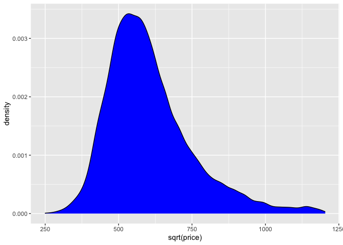
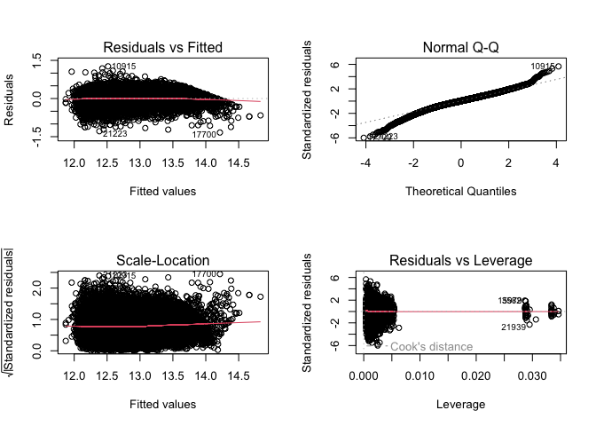

Modeling
================
Shea Conaway

``` r
# packages
library(dplyr)
library(readr)
library(ggplot2)
```

# Data

``` r
# data
df <- read_csv('../data/2_cleaned/cleaned_data.csv',show_col_types =FALSE)
```

-   One-hot encode categorical variables

``` r
# home type

df$condo <- ifelse(df$home_type == 'CONDO', 1, 0)
df$single_family <- ifelse(df$home_type == 'SINGLE_FAMILY', 1, 0)
df$townhouse <- ifelse(df$home_type == 'TOWNHOUSE', 1, 0)
```

``` r
# neighborhood

neighborhoods <- unique(df$neighborhood)
num_hoods <- length(neighborhoods) # 24

for(i in 1:num_hoods) {
  new <- ifelse(df$neighborhood == neighborhoods[i], 1, 0)
  df[ , ncol(df) + 1] <- new
  colnames(df)[ncol(df)] <- paste0('neighborhood_', i) 
  }

var_hoods <- c()
for(i in 1:num_hoods) {
  var_hoods <- c(var_hoods,paste0('neighborhood_', i))
}
```

``` r
var_hoods <- c()
for(i in 1:num_hoods) {
  var_hoods <- c(var_hoods,paste0('neighborhood_', i))
}
```

``` r
# subset to desired variables
df <- subset(df,select = -c(zpid
                   ,price_sqft
                   ,home_type
                   ,date_sold
                   ,date_listed
                   ,days_on_market
                   ,date_sold_previous
                   ,age
                   ,year_built
                   ,description
                   ,photo_count
                   ,longitude
                   ,latitude
                   ,neighborhood
                   ,address_state
                   ,address_city
                   ,address_zipcode
                   ,address_street
                   ,parcel_id
                   ,url
                   ,favorite_count
                   ,page_view_count
                   ,home_status))
```

``` r
# train/test split
set.seed(20221217)
row.number <- sample(1:nrow(df), 0.8*nrow(df))
train = df[row.number,]
test = df[-row.number,]
dim(train)
```

    ## [1] 23222    33

``` r
dim(test)
```

    ## [1] 5806   33

-   Check for the distribution of response variable `price`
-   The following figure shows the three distributions of `price`
    -   original
    -   log transformation
    -   square root transformation
-   The original distribution is right skewed, as expected with prices.
    The log transformation does a decent job of normalizing, which is
    more appropriate for a linear model.

``` r
##Explore the data.
ggplot(train, aes(price)) + geom_density(fill="blue")
```

<!-- -->

``` r
ggplot(train, aes(log(price))) + geom_density(fill="blue")
```

<!-- -->

``` r
ggplot(train, aes(sqrt(price))) + geom_density(fill="blue")
```

<!-- -->

# Model

-   First model isn’t bad for not including neighborhood or home type

``` r
# first model

model1 = lm(log(price) ~ living_area + bedrooms + bathrooms + downtown_dist, data=train)
summary(model1)
```

    ## 
    ## Call:
    ## lm(formula = log(price) ~ living_area + bedrooms + bathrooms + 
    ##     downtown_dist, data = train)
    ## 
    ## Residuals:
    ##      Min       1Q   Median       3Q      Max 
    ## -1.32296 -0.14989  0.01033  0.16515  1.21247 
    ## 
    ## Coefficients:
    ##                 Estimate Std. Error  t value Pr(>|t|)    
    ## (Intercept)    1.222e+01  7.920e-03 1542.600   <2e-16 ***
    ## living_area    3.716e-04  3.824e-06   97.175   <2e-16 ***
    ## bedrooms      -1.921e-03  3.030e-03   -0.634    0.526    
    ## bathrooms      8.059e-02  2.788e-03   28.908   <2e-16 ***
    ## downtown_dist -5.048e-02  4.729e-04 -106.739   <2e-16 ***
    ## ---
    ## Signif. codes:  0 '***' 0.001 '**' 0.01 '*' 0.05 '.' 0.1 ' ' 1
    ## 
    ## Residual standard error: 0.2592 on 23217 degrees of freedom
    ## Multiple R-squared:  0.677,  Adjusted R-squared:  0.6769 
    ## F-statistic: 1.217e+04 on 4 and 23217 DF,  p-value: < 2.2e-16

``` r
par(mfrow=c(2,2))
plot(model1)
```

<!-- -->

Multiple R-squared: 0.7606. Not bad.

``` r
# second model

model2 = lm(log(price) ~ .-townhouse-neighborhood_24, data=train) # don't need last one-hots
summary(model2)
```

    ## 
    ## Call:
    ## lm(formula = log(price) ~ . - townhouse - neighborhood_24, data = train)
    ## 
    ## Residuals:
    ##      Min       1Q   Median       3Q      Max 
    ## -1.33613 -0.12430  0.00846  0.13961  1.26526 
    ## 
    ## Coefficients:
    ##                   Estimate Std. Error t value Pr(>|t|)    
    ## (Intercept)      1.231e+01  4.148e-02 296.698  < 2e-16 ***
    ## bedrooms         8.508e-03  2.796e-03   3.043 0.002343 ** 
    ## bathrooms        1.008e-01  2.678e-03  37.646  < 2e-16 ***
    ## living_area      2.686e-04  3.659e-06  73.399  < 2e-16 ***
    ## lot_size         1.885e-06  2.086e-07   9.036  < 2e-16 ***
    ## downtown_dist   -3.074e-02  1.037e-03 -29.651  < 2e-16 ***
    ## condo            3.891e-02  7.718e-03   5.042 4.65e-07 ***
    ## single_family    1.311e-01  6.762e-03  19.391  < 2e-16 ***
    ## neighborhood_1  -2.615e-03  4.206e-02  -0.062 0.950420    
    ## neighborhood_2  -2.790e-01  4.198e-02  -6.646 3.08e-11 ***
    ## neighborhood_3  -2.724e-01  4.176e-02  -6.523 7.03e-11 ***
    ## neighborhood_4   5.508e-02  4.284e-02   1.286 0.198560    
    ## neighborhood_5  -1.182e-01  4.148e-02  -2.850 0.004374 ** 
    ## neighborhood_6  -3.360e-01  4.251e-02  -7.903 2.84e-15 ***
    ## neighborhood_7  -1.643e-01  4.309e-02  -3.814 0.000137 ***
    ## neighborhood_8  -3.789e-01  4.160e-02  -9.107  < 2e-16 ***
    ## neighborhood_9  -2.976e-01  4.249e-02  -7.004 2.55e-12 ***
    ## neighborhood_10 -3.865e-01  4.276e-02  -9.039  < 2e-16 ***
    ## neighborhood_11 -1.846e-01  4.296e-02  -4.298 1.73e-05 ***
    ## neighborhood_12 -4.534e-01  4.231e-02 -10.716  < 2e-16 ***
    ## neighborhood_13 -5.673e-01  4.305e-02 -13.179  < 2e-16 ***
    ## neighborhood_14 -3.254e-01  4.288e-02  -7.589 3.35e-14 ***
    ## neighborhood_15 -4.784e-01  4.272e-02 -11.199  < 2e-16 ***
    ## neighborhood_16 -1.597e-01  4.171e-02  -3.829 0.000129 ***
    ## neighborhood_17  1.629e-02  4.216e-02   0.386 0.699235    
    ## neighborhood_18 -1.064e-01  4.151e-02  -2.564 0.010362 *  
    ## neighborhood_19  9.399e-02  4.230e-02   2.222 0.026288 *  
    ## neighborhood_20 -3.935e-01  4.204e-02  -9.360  < 2e-16 ***
    ## neighborhood_21  1.031e-01  4.247e-02   2.427 0.015231 *  
    ## neighborhood_22 -4.469e-01  5.685e-02  -7.860 4.02e-15 ***
    ## neighborhood_23 -3.010e-02  4.427e-02  -0.680 0.496594    
    ## ---
    ## Signif. codes:  0 '***' 0.001 '**' 0.01 '*' 0.05 '.' 0.1 ' ' 1
    ## 
    ## Residual standard error: 0.2233 on 23191 degrees of freedom
    ## Multiple R-squared:  0.7606, Adjusted R-squared:  0.7603 
    ## F-statistic:  2456 on 30 and 23191 DF,  p-value: < 2.2e-16

``` r
par(mfrow=c(2,2))
plot(model2)
```

<!-- -->

# Test

``` r
# error
pred1 <- predict(model2, newdata = test)
rmse <- sqrt(sum((exp(pred1) - test$price)^2)/length(test$price))
c(RMSE = rmse, R2=summary(model2)$r.squared)
```

    ##         RMSE           R2 
    ## 1.034694e+05 7.605668e-01

``` r
# plot
par(mfrow=c(1,1))
plot(test$price, exp(pred1))
abline(coef = c(0, 1), c = 'red')
```

<!-- -->
