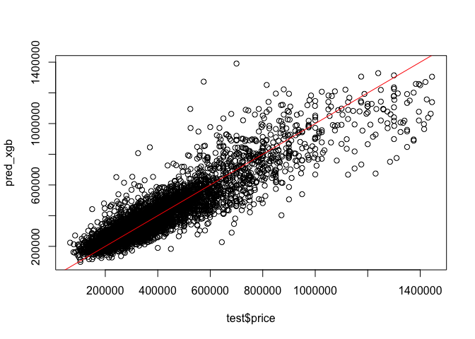

Modeling
================
Shea Conaway

``` r
# packages
library(xgboost) #for fitting the xgboost model
library(caret) # data prep and model fitting
```

# Data

``` r
# data
df <- read.csv('../data/2_cleaned/cleaned_data.csv')
```

``` r
# one-hot encode categoricals

# home type
# default single family
# encode condo or townhouse
df$condo <- ifelse(df$home_type == 'CONDO', 1, 0)
df$townhouse <- ifelse(df$home_type == 'TOWNHOUSE', 1, 0)

# neighborhood
# default neighborhood 1 (Green Hills / Forest Hills / Belle Meade)
neighborhoods <- unique(df$neighborhood)
num_hoods <- length(neighborhoods) # 24
# loop enconding
for(i in 2:num_hoods) {
  new <- ifelse(df$neighborhood == neighborhoods[i], 1, 0)
  df[ , ncol(df) + 1] <- new
  colnames(df)[ncol(df)] <- paste0('neighborhood_', i) 
  }
```

``` r
# subset to desired variables
df <- subset(df,select = -c(zpid
                   ,price_sqft
                   ,home_type
                   ,date_sold
                   ,date_listed
                   ,days_on_market
                   ,date_sold_previous
                   ,age
                   ,year_built
                   ,description
                   ,photo_count
                   ,longitude
                   ,latitude
                   ,neighborhood
                   ,address_state
                   ,address_city
                   ,address_zipcode
                   ,address_street
                   ,parcel_id
                   ,url
                   ,favorite_count
                   ,page_view_count
                   ,home_status))
```

``` r
# a little additional lot size cleaning
df <- df[!df$lot_size == 0,]
df <- df[!df$lot_size == 1,]
# lot size should be at least as large as living area
df$lot_size[df$lot_size < df$living_area] <- df$living_area[df$lot_size < df$living_area]
```

# Model

## Linear Regression

Linear regression models are well-understood and easily explained. They
serve as a good baseline model in a regression task to gut-check more
sophisticated approaches.

The target variable distribution is right skewed, as expected with home
prices. The log transformation does a decent job of normalizing, which
is more appropriate for a linear model. Log transformations are also
applied to the skewed features.

``` r
d = density(df$price)
plot(d, main = 'price')
polygon(d, col='gray')
```

<!-- -->

``` r
d_log = density(log(df$price))
plot(d_log, main = 'price')
polygon(d_log, col='gray')
```

<!-- -->

``` r
# feature log transformations
df$bedrooms <- log(df$bedrooms)
df$bathrooms <- log(df$bathrooms)
df$living_area <- log(df$living_area)
df$lot_size <- log(df$lot_size)
```

``` r
# train/test split
set.seed(20221217)

# 80/20
parts = caret::createDataPartition(df$price, p = .8, list = F)
train = df[parts, ]
test = df[-parts, ]

dim(train)
```

    ## [1] 23207    31

``` r
dim(test)
```

    ## [1] 5801   31

``` r
# linear model training
model_lm = lm(log(price) ~ ., data=train)
summary(model_lm)
```

    ## 
    ## Call:
    ## lm(formula = log(price) ~ ., data = train)
    ## 
    ## Residuals:
    ##      Min       1Q   Median       3Q      Max 
    ## -1.26566 -0.12557  0.00309  0.13734  1.28286 
    ## 
    ## Coefficients:
    ##                  Estimate Std. Error t value Pr(>|t|)    
    ## (Intercept)      8.436791   0.049452 170.604  < 2e-16 ***
    ## bedrooms        -0.023794   0.008397  -2.834  0.00461 ** 
    ## bathrooms        0.182758   0.005995  30.483  < 2e-16 ***
    ## living_area      0.600369   0.007249  82.819  < 2e-16 ***
    ## lot_size         0.029067   0.002456  11.835  < 2e-16 ***
    ## downtown_dist   -0.034930   0.001019 -34.284  < 2e-16 ***
    ## condo           -0.065813   0.006350 -10.365  < 2e-16 ***
    ## townhouse       -0.099901   0.007170 -13.934  < 2e-16 ***
    ## neighborhood_2  -0.327735   0.010262 -31.935  < 2e-16 ***
    ## neighborhood_3  -0.314266   0.012059 -26.061  < 2e-16 ***
    ## neighborhood_4   0.018517   0.015342   1.207  0.22746    
    ## neighborhood_5  -0.160811   0.009814 -16.386  < 2e-16 ***
    ## neighborhood_6  -0.383310   0.011361 -33.738  < 2e-16 ***
    ## neighborhood_7  -0.189173   0.013010 -14.541  < 2e-16 ***
    ## neighborhood_8  -0.435554   0.010520 -41.404  < 2e-16 ***
    ## neighborhood_9  -0.338777   0.013775 -24.594  < 2e-16 ***
    ## neighborhood_10 -0.425866   0.011858 -35.915  < 2e-16 ***
    ## neighborhood_11 -0.212172   0.012399 -17.112  < 2e-16 ***
    ## neighborhood_12 -0.482208   0.011643 -41.415  < 2e-16 ***
    ## neighborhood_13 -0.612347   0.014824 -41.307  < 2e-16 ***
    ## neighborhood_14 -0.332129   0.012948 -25.651  < 2e-16 ***
    ## neighborhood_15 -0.529689   0.012725 -41.625  < 2e-16 ***
    ## neighborhood_16 -0.207629   0.010640 -19.514  < 2e-16 ***
    ## neighborhood_17 -0.021011   0.011557  -1.818  0.06907 .  
    ## neighborhood_18 -0.166906   0.010382 -16.077  < 2e-16 ***
    ## neighborhood_19  0.064088   0.012731   5.034 4.84e-07 ***
    ## neighborhood_20 -0.435233   0.010900 -39.931  < 2e-16 ***
    ## neighborhood_21  0.062042   0.013626   4.553 5.31e-06 ***
    ## neighborhood_22 -0.462511   0.039612 -11.676  < 2e-16 ***
    ## neighborhood_23 -0.072716   0.016698  -4.355 1.34e-05 ***
    ## neighborhood_24  0.091196   0.041941   2.174  0.02969 *  
    ## ---
    ## Signif. codes:  0 '***' 0.001 '**' 0.01 '*' 0.05 '.' 0.1 ' ' 1
    ## 
    ## Residual standard error: 0.2187 on 23176 degrees of freedom
    ## Multiple R-squared:  0.7721, Adjusted R-squared:  0.7718 
    ## F-statistic:  2617 on 30 and 23176 DF,  p-value: < 2.2e-16

``` r
# linear regression prediction and error
pred_lm <- predict(model_lm, newdata = test)
rmse_lm <- sqrt(sum((exp(pred_lm) - test$price)^2)/length(test$price))
rmse_lm
```

    ## [1] 93424.88

``` r
# plot
plot(test$price, exp(pred_lm))
abline(coef = c(0, 1), c = 'red')
```

<!-- -->

## XGBoost

XGBoost belongs to a class of models popular throughout many industries
because of its performance on a variety problems. It is a
decision-tree-based ensemble algorithm that uses the gradient boosting
framework. Most boosting algorithms consist of iteratively learning weak
classifiers to reduce residuals. A gradient-boosted trees model
generalizes this method by allowing optimization of an arbitrary
differentiable loss function.

``` r
# additional xgboost data formatting

# train
train_x = data.matrix(train[, -1])
train_y = train[,1]
# test
test_x = data.matrix(test[, -1])
test_y = test[,1]
# final format for xgboost
xgb_train = xgb.DMatrix(data = train_x, label = train_y)
xgb_test = xgb.DMatrix(data = test_x, label = test_y)
```

``` r
# xgboost training
model_xgb = xgb.train(data = xgb_train, max.depth = 3, nrounds = 350)
```

``` r
# xgb prediction and error
pred_xgb <- predict(model_xgb, newdata = test_x)
rmse_xgb <- caret::RMSE(test_y, pred_xgb)
rmse_xgb
```

    ## [1] 87721.23

``` r
# plot
plot(test$price, pred_xgb)
abline(coef = c(0, 1), c = 'red')
```

<!-- -->

# Comparison

XGBoost results in a 6% reduction in RMSE.

``` r
# performance comparison
1 - rmse_xgb/rmse_lm
```

    ## [1] 0.06105061
